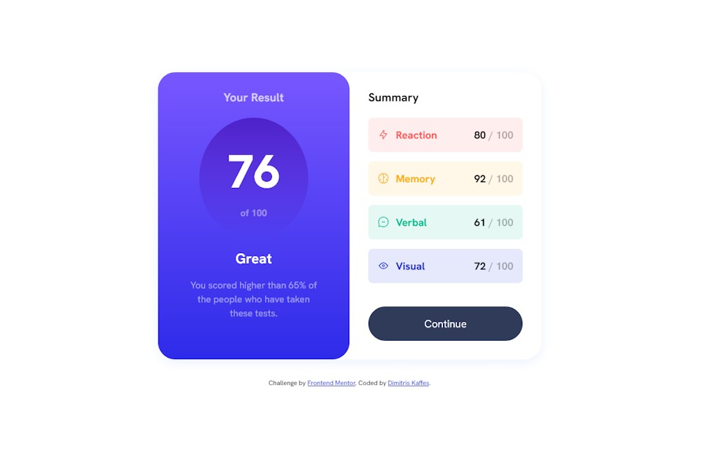

# Frontend Mentor - Results summary component solution

This is a solution from Dimitris Kaffes to the [Results summary component challenge on Frontend Mentor](https://www.frontendmentor.io/challenges/results-summary-component-CE_K6s0maV).

## Table of contents

- [Overview](#overview)
  - [The challenge](#the-challenge)
  - [Screenshot](#screenshot)
  - [Links](#links)
- [My process](#my-process)
  - [Built with](#built-with)
  - [What I learned](#what-i-learned)
  - [Continued development](#continued-development)
  - [Useful resources](#useful-resources)
- [Author](#author)

## Overview

This challenge is a good practice for Grid and Flex layouts. The implementation of color gradients for the backgrounds and the proper use of button active states were among the challenge's goals.

A modern CSS reset (by Andy Bell) was implemented. However, this CSS reset introduces some margin issues (it does not remove all margins) that need to be investigated. See the comments in the `style.ccs` for more.

The JSON related bonus challenge was not implemented.

### The challenge

Users should be able to:

- View the optimal layout for the interface depending on their device's screen size
- See hover and focus states for all interactive elements on the page

### Screenshot

### Links

- Solution URL: [results-summary-component solution on Github](https://github.com/dkaffes/results-summary-component)
- Live Site URL: [results-summary-component live site](https://dkaffes.github.io/results-summary-component/)

## My process

Semantic HTML elements were used.

The CSS Reset from Andy Bell was implemented.

Mobile-first approach was followed.

For the font sizes, I experimented with a type scale tool so as to create a custom typograph system. Not much needed in this challenge though.

Custom properties were used for the colors, font sizes and font weights. Could also be considered an overkill.

Two containers, for the result content and the summary content, were used inside the parent component container.

For the background gradients needed, the background: linear-gradient() property was used with the hex codes for the two colors. The above property does not seem to work with variables or hsl values for the colors.

For the desktop version, a media query was used, basically using Grid to create the two columns for Result and Summary. Furthermore, changes that were made to some font sizes, paddings, margins etc formed the desktop design.

### Built with

- Semantic HTML5 markup
- CSS custom properties
- Flexbox
- CSS Grid
- Mobile-first workflow

### What I learned

- The importance of a good HTML structure was once more a lesson learned from this challenge.

### Continued development

Investigate other than Andy Bell's CSS reset. This one seems to have margin issues.

### Useful resources

- [Baseline - Type Scale Generator](https://baseline.is/tools/type-scale-generator/) - This helped me understand the usage of a type scale generator for creating a consistent typography system.

## Author

- Frontend Mentor - [@dkaffes](https://www.frontendmentor.io/profile/dkaffes)
